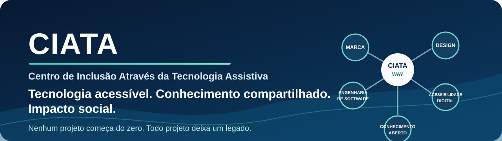

# CIATA

## Centro de Inclusão Através da Tecnologia Assistiva

O **CIATA** é uma organização brasileira sem fins lucrativos que desenvolve tecnologia, promove inclusão e transforma experiência prática em conhecimento aberto e reutilizável.

Acessibilidade não entra no fim da fila. Ela nasce com o requisito, atravessa arquitetura, design, conteúdo, desenvolvimento e testes, e permanece durante toda a evolução do produto.

> **Nenhum projeto começa do zero. Todo projeto deixa um legado.**

## Nossa missão

Criar e compartilhar tecnologias que ampliem autonomia, comunicação, educação, acesso à cultura, empregabilidade e participação social das pessoas com deficiência.

## Como trabalhamos

- **Pessoas antes da tecnologia:** inovação só tem valor quando melhora experiências reais.
- **Acessibilidade desde a concepção:** acesso é requisito de arquitetura, design, conteúdo, código, testes e entrega.
- **Conhecimento como patrimônio:** decisões, padrões, evidências e aprendizados devem sobreviver aos projetos.
- **Reutilização antes da reinvenção:** cada iniciativa começa a partir do que o ecossistema já aprendeu.
- **Qualidade verificável:** testes automáticos ajudam, mas a validação humana continua indispensável.
- **Colaboração responsável com IA:** agentes trabalham com fontes canônicas, limites claros e revisão proporcional ao risco.

## Ecossistema CIATA

| Iniciativa | Propósito |
| --- | --- |
| [Comunica-CIATA](https://github.com/CIATA-BR/Comunica-CIATA) | Ecossistema de comunicação acessível para Android e iOS, pensado para leitores de tela, teclado e linhas Braille. |
| Biblioteca CIATA | Biblioteca digital acessível para estudo, pesquisa, cultura e lazer. |
| Emprega CIATA | Plataforma que aproxima profissionais com deficiência e organizações comprometidas com inclusão. |
| Portal CIATA | Presença institucional e ponto de acesso aos serviços, projetos e conteúdos da organização. |
| [CIATA Play Toolkit](https://github.com/CIATA-BR/CIATA-Play-Toolkit) | Ferramenta acessível para preparar, validar, documentar e acompanhar publicações no Google Play. |
| [CIATA Design System](https://github.com/CIATA-BR/CIATA-DS) | Fonte oficial dos padrões reutilizáveis de marca, design, engenharia, acessibilidade e conhecimento do ecossistema. |
| Jieshuo | Colaboração internacional em tradução, suporte e licenciamento do leitor de telas Jieshuo. |

## CIATA Engineering

O **CIATA Engineering** organiza o conhecimento técnico produzido nos projetos para que ele possa ser encontrado, compreendido, validado e reutilizado por pessoas, equipes e agentes de inteligência artificial.

O trabalho é estruturado em cinco sistemas conectados:

1. **Brand System:** identidade institucional e aplicação consistente da marca.
2. **Design System:** interação, conteúdo, comportamento, componentes e experiência.
3. **Engineering System:** arquitetura, qualidade, documentação, segurança, entrega e operação.
4. **Accessibility Engineering System:** normas, plataformas, tecnologias assistivas, padrões, testes, evidências e conhecimento aplicado.
5. **Knowledge System:** decisões, pesquisas, receitas, casos reais, antipadrões e lições aprendidas.

A fonte canônica desses padrões é o [CIATA Design System](https://github.com/CIATA-BR/CIATA-DS).

## Acessibilidade em prática

Nossas práticas incluem WCAG, navegação por teclado, foco previsível, linguagem clara, conteúdo localizável, compatibilidade com Braille e testes com tecnologias como TalkBack, VoiceOver, NVDA, JAWS, Narrator e Orca.

Barreiras de acessibilidade são tratadas como problemas funcionais. Verificações automáticas apoiam o processo, mas não substituem testes manuais nem a participação de pessoas com deficiência.

## Tecnologias

Trabalhamos com Kotlin, Jetpack Compose, Swift, SwiftUI, PHP, Laravel, bancos de dados relacionais, GitHub Actions, serviços em nuvem, automação e inteligência artificial.

## Como contribuir

Contribuições de código, documentação, tradução, design, pesquisa, testes, relatos de barreiras e propostas de melhoria são bem-vindas.

Consulte o [guia institucional de contribuição](../CONTRIBUTING.md) e as orientações específicas do repositório escolhido. Valorizamos mudanças focadas, descrições claras, evidências verificáveis, respeito às decisões registradas e acessibilidade em todas as etapas.

## Contato

- Site: [ciata.org.br](https://ciata.org.br)
- E-mail: [contato@ciata.org.br](mailto:contato@ciata.org.br)
- LinkedIn: [CIATA](https://linkedin.com/company/ciatabr)
- X: [@ciatabr](https://x.com/ciatabr)
- Facebook: [CIATA](https://facebook.com/ciatabr)

---

**Construindo tecnologia acessível para hoje. Preservando conhecimento para amanhã. Compartilhando experiência para sempre.**
